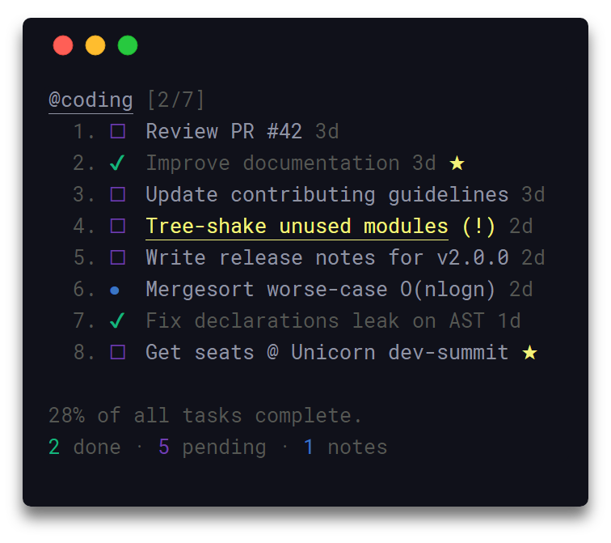
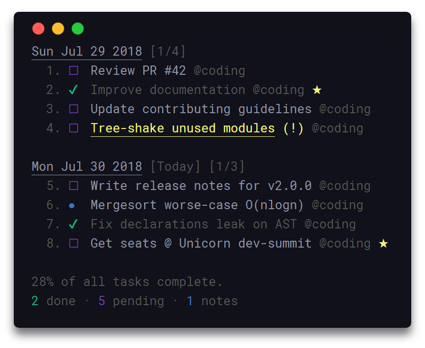

<h1 align="center">
  Taskbook
</h1>

<h4 align="center">
  📓 Задачи, разделы и заметки для коммандной строки
</h4>

<div align="center">
  
</div>

<p align="center">
  <a href="https://travis-ci.com/klaussinani/taskbook">
    
  </a>
</p>

## Описание

Используя простой и минимальный синтаксис, taskbook позволяет эффективно управлять задачами и заметками через несколько разделов в терминале. Все данные атомарно записываются в хранилище для предотвращения повреждений и ни с чем и ни с кем не распространяется. Удаленные записи автоматически сохраняются в архиве и могут быть просмотрены, либо восстановлены в любой момент. 

Можете прочитать этот документ на [简体中文](https://github.com/klaussinani/taskbook/blob/master/docs/readme.ZH.md).

Зайдите на [contributing guidelines](https://github.com/klaussinani/taskbook/blob/master/contributing.md#translating-documentation) для того, чтобы больше узнать о том, как перевести этот документ на другие языки.

Присоединяйтесь к [Gitter](https://gitter.im/klaussinani/taskbook), или [Twitter](https://twitter.com/klaussinani), чтобы поделиться своим мнением об этом проекте.

## Особенности

- Организация задач и заметок в разделах задач
- Раздел задач и просмотр хронологии
- Приоритетность и любимые механизмы
- Поиск и фильтрация записей
- Архивация и восстановление удаленных записей
- Легкий и быстрый
- Данные автоматически записываются в хранилище
- Выбор места хранилища 
- Просмотр прогресса
- Простое и минимальное использование синтаксиса
- Уведомления об обновлениях
- Конфигурируемый через `~/.taskbook.json`
- Данные хранятся в формате JSON в `~/.taskbook/storage`

Просмторите особенности в [разделе taskbook](https://raw.githubusercontent.com/klaussinani/taskbook/master/media/highlights.png).

## Содержание

- [Описание](#description)
- [Особенности](#highlights)
- [Установка](#install)
- [Использование](#usage)
- [Обзоры](#views)
- [Конфигурация](#configuration)
- [Руководство по полету](#flight-manual)
- [Разработка](#development)
- [Относится](#related)
- [Команда](#team)
- [Лицензия](#license)

## Установка

```bash
npm install --global taskbook
```

## Использование

```
$ tb --help

  Использование
    $ tb [<options> ...]

    Опции
        none             Показать разделы
      --task, -t         Создать задачу
      --note, -n         Создать заметку
      --timeline, -i     Отобразить хронологию
      --delete, -d       Удаление записи
      --check, -c        Поставить/Отменить метку на задаче
      --star, -s         Добавить запись в избранное/Снять с избранных
      --list, -l         Показать элементы списком по аттрибутам
      --find, -f         Поиск по записям
      --edit, -e         Редактировать описание записи
      --move, -m         Перетащить запись между разделами
      --priority, -p     Обновить приоритет задачи
      --archive, -a      Отобразить заархивированные записи
      --restore, -r      Восстановить записи с архива
      --help, -h         Показать текст помощи
      --version, -v      Показать установленную версию

    Примеры
      $ tb
      $ tb --task Сделать сэндвич
      $ tb --task @кодинг Улучшить документацию
      $ tb --task @кодинг @обзоры Обзор PR #42
      $ tb --note @coding Mergesort худший случай O(nlogn)
      $ tb --check 1 2
      $ tb --delete 4
      $ tb --star 2
      $ tb --priority @3 2
      $ tb --timeline
      $ tb --edit @3 Merge PR #42
      $ tb --move @1 готовка
      $ tb --find документация
      $ tb --list pending кодинг
      $ tb --archive
      $ tb --restore 4
```

## Обзоры

### Обзор раздела

Запуск taskbook без каких-либо опций покажет все сохраненные записи, сгрупированные по их соответвующим разделам.

<div align="center">
  
</div>

### Обзор хронологии

Для просмотра всех записей соответственно хронологии по дате создания, может быть использована опция `--timeline`/`-i`.

<div align="center">
  
</div>

## Конфигурация

Для конфигурации taskbook зайдите в файл `~/.taskbook.json` и измените любые опции под себя. Для восстановаления настроек по умолчанию, просто удалите концигурацинный файл в домашней директории.

Ниже показаны все доступные опции и их соответвствующие значения по умолчанию.

```json
{
  "taskbookDirectory": "",
  "displayCompleteTasks": true,
  "displayProgressOverview": true
}
```

### Детально

##### `taskbookDirectory`

- Тип: `String`
- По умолчанию: `~`

Полный системный путь, где хранилище будет создано и т.д; `/home/username/the-cloud`

Если оставите неопределенным, домашняя директива `~` будет использована и taskbook будет настроен внутри `~/.taskbook/`.

##### `displayCompleteTasks`

- Тип: `Boolean`
- По умолчанию: `true`

Показ задач, которые завершены

##### `displayProgressOverview`

- Тип: `Boolean`
- По умолчанию: `true`

Показ прогресса ниже хронологии и обзора разделов.

## Руководство по полетам

Ниже приведено небольшое руководство с примерами по использованию taskbook.
В случаи, если вы обнаружили ошибку или считаете, что пример недостаточно понятен и может быть обьяснено лучше, не стесняйтесь заводить [issue](https://github.com/klaussinani/taskbook/issues/new/choose), либо [pull request](https://github.com/klaussinani/taskbook/compare).

### Создать задачу

Для создания новой задачи используйте опцию `--task`/`-t` слеудуя с описанием вашей задачи. 

```
$ tb -t Улучшить документацию
```

### Создать заметку

Для создания новой заметки используйте опцию `--note`/`-n` с последующим описанием вашей заметки. 

```
$ tb -n Mergesort худший случай O(nlogn)
```

### Создать раздел

Разделы создаются автоматически при создании новой задачи, либо новой заметки. Для создания одного и более разделов, напишите их наименования с префиксом `@` в описании записей, которые создадутся. В конечном результате, новая запись будет создана во всех тех разделах, которые вы указали. По умолчания, все записи, у которых не указан раздел, автоматически добавляются в раздел по умолчанию; `My Board`.

```
$ tb -t @кодинг @доки Обновление руководста по контибуции
```

### Пометить задачу

Чтобы пометить задачу как выполненная/невыполненная, используйте опцию `--check`/`-c` c послудующими id ваших задач. Заметье, что данная опция обновит статус `complete` задач на противоположный, поэтому пометка завершенной задачи будет отображатся как в процессе, а та задача, которая в процессе на завершенную. Дублирующиеся id автоматически отфильтровываются.

```
$ tb -c 1 3
```

### Добавить запись в избранные

Чтобы отметить одну и более задачи, как избранные, используйте опцию `--star`/`-s` с последующими id намеченных записей. Функиональность данной опции такая же, как и одна из тех опций `--check`, которые описаны выше.

```
$ tb -s 1 2 3
```

### Отображение разделов

Запуск taskbook без опций отобразит все сохраненные запсиси, распределенные по их соответствующим разделам.

```
$ tb
```

### Оторбажение хронологии

Для отображения всех записей в хронологическом порядке, основанное на дате создания, может быть использована опция `--timeline`/`-i`.

```
$ tb -i
```

### Назначение приоритета

Чтобы назначить приоритет для задачи по время создания, добавьте синтакс `p:x`в описании задачи, где x значение integer `1`, `2` или `3`. Заметьте, что все задачи по умолчанию создаются с нормальным приоритетом  - `1`.
 
- `1` - Нормальный приоритет
- `2` - Средний приоритет
- `3` - Высокий приоритет

```
$ tb -t @кодинг Исправить проблему `#42` p:3
```

Чтобы обновить приоритет определенной задачи после создания, используйте опцию `--priority`/`-p` вместе с id намеченной задачи префиком `@`, и следуя значением integer `1`, `2` or `3`. Заметьте, что последовательность уровня приоритета и id намеченного таска не важна.

```
$ tb -p @1 2
```

### Перемещение записи

Для того, чтобы перестить записи на одну или множество разделов, необходимо использовать опцию  `--move`/`-m` , с последующим id записи с префиксом @ и наименования тех разделов, в которые вы хотите перенести. Раздел по умолчанию `My board` можно взять с помощью ключевого слова `myboard`. Полследовательность намеченного id таска и наименований разделов в команде не важна.

```
$ tb -m @1 myboard отзывы
```

### Удаление записи

Для удаления одного и более записей используйте опцию `--delete`/`-d` с последующим id намеченных записей. Заметьте, что удаленные записи автоматически архивируются и могут быть осмотрены, либо восстановлены в любой момент. Дублирующиеся id автоматически отфильтровываются.

```
$ tb -d 1 2
```

### Отображение архива

Для отображения всех зааривированных записей используйте опцию `--archive`/`-a`. Заметьте, что все заархивированные записи будут отображаться в хронологическом порядке по дате создания.

```
$ tb -a
```

### Восстановление записей

Для восстановления одного и более записей используйте опцию `--restore`/`-r` с последующим id намеченных записей. Заметьте, что id заархивированных записей могут быть увидены при запуске опции `--archive`/`-a`. Дублирующиеся id автоматически отфильтровываются.

```
$ tb -r 1 2
```

### Вывести записи списком 

Чтобы вывести группу записей списком, где каждая запись компилируется со специфичным числом аттрибутов, используйте опцию `--list`/`-l` следуя с желаемыми аттриутами. Названия разделов вместе с признаками элемента могут считать действительными аттрибутами списка. Для примера отображения записей списком, которые относятся к разделу по умолчанию `myboard` и являются в ожидании, последующая команда может быть использована;

```
$ tb -l myboard pending
```

Ниже приведены дефолтовые поддерживаемые аттрибуты списка вместе с их псевдонимами;

- `myboard` - Записи, которые принадежат разделу `My board`
- `task`, `tasks`, `todo` - Записи, которые являются задачами.
- `note`, `notes` - Записи, которые являются заметками.
- `pending`, `unchecked`, `incomplete` - Записи, которые в ожидании.
- `done`, `checked`, `complete` - Записи, которые являются завершенными.
- `star`, `starred` - Записи, добавленные в избранные.

### Поиск записей

Для поиска одного и более записей используйте опцию `--find`/`-f`, с последующим словом поиска. 

```
$ tb -f документация
```

## Разработка

Для большей информации о том, как можно способствовать этому проекту, пожалуйста, прочитайте [contributing guidelines](https://github.com/klaussinani/taskbook/blob/master/contributing.md).

- Форкните данную репозиторию и склонируйте на вашу машину
- Перейдите на ваш склонированный проект: `cd taskbook`
- Установаите зависимости проекта: `npm install` либо `yarn install`
- Проверьте код на ошибки: `npm test` либо `yarn test`

## Относится

- [chalk](https://github.com/chalk/chalk) - Стилизация строк в терминале
- [signale](https://github.com/klaussinani/signale) - Автономный консольный логгер

## Команда

- Klaus Sinani [(@klaussinani)](https://github.com/klaussinani)

## Лицензия

[MIT](https://github.com/klaussinani/taskbook/blob/master/license.md)
